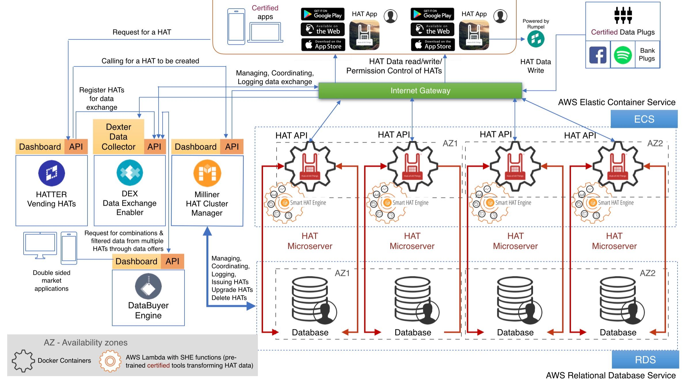

# Knowing the HAT Tech Ecosystem

### HAT Platform Process Architecture 

The HAT Platform operates through four main bodies: HAT users; HAT applications; the HAT Community Foundation (HCF), non-profit arm of the HAT Platform; and HATDeX, a provider of data exchange and transaction clearing services. These bodies have distinct, interoperable and interdependent functions within the platform. 

### HAT Application 

HAT Applications provide web applications and services directly to users, functioning like ‘normal’ applications except that the user account for a HAT Application is a HAT PDMA ([private ‘microserver’ data account] (https://www.hatdex.org/digital-dependency/). Within the HAT Ecosystem, a HAT user owns their HAT and is the sole party with login permission to their PDMA. Only they can view and interact with the data stored there, only they can manage their incoming data (through Data Plugs) or create new data (through the use of HAT Applications), and only they can control their PDMA’s data exchanges. HAT Applications often provide branded applications with which the user can interface with the HAT and conduct all of these activities. 

All HAT applications could have up to four ‘core HAT functionalities:’
   1.	HAT Single Sign-on. Single-provision “login with the HAT” functionality that allows HAT users to shares certain data (e.g. name, email address) with the application.
   2.	HAT PDMA Provisioning. Creation and deployment of a HAT PDMA for the user on the HAT application’s own infrastructure, to replace the normal user account of the application. This makes the HAT application a HAT Service Provider (HSP). As a HAT Service Provider, applications provision HATs to their customers under their own brand.  Certified HAT Service Providers are allocated a volume of HAT addresses, all of which are certified to operate within the ecosystem, and fully interoperable with other HATs. HAT Service Providers are required to provide a dashboard service for their customers, or use the standard Rumpel dashboard. HATDeX’s “Milliner” cloud provisioning service is available upon request through a simple API request.
   3.	HAT Trading Platform Capability. The HATDeX Trading Platform Service offers opportunities for HAT Applications to create online marketplaces in which users’ data can be exchanged for personalised goods and services. Trading Platform Capability allows the application to build two-sided market application: merchants may sign up as a vendor on the platform (merchant onboarding), and publish an exchange or ‘Data Offer’ which offers goods or services in exchange for users’ data within the Trading Platform. HAT users may sign on to the Trading Platform to browse and manage the offers included in the service. Agreed Data Offers establish a Data Debit between the vendor and the HAT user, specifying the parties involved, the purpose of the exchange, the length of the exchange contract, and the data required for the transaction. Prior to the data offer’s being made available to the user, an application with a Trading Platform can also provide offer matching, a service allowing offers to be more accurately defined to target user groups by matching Data Offers to a user’s voluntary profile. For example, a Trading Platform may allow offers to target users in a specific age range. In order to maximise the users’ control over their data exposure, and to avoid unnecessary mass computation of users’ profiles, matching control and offer display sits independently from the Trading Platform, operated by the HAT, privately for its users. Trading Platform applications therefore do not have access to the entire user group that contains a matching profile. Rather, they gain visibility only over those who have decided to accept the data offer, follows the principles of privacy-by-design.

Trading Platform Services are offered by HATDeX and operate in the background of all trading platform applications. These services include:
  * Offer registration – HATDeX can register offers from a Trading Platform application and make registered offers available elsewhere in the ecosystem;
  * Offer status tracking – HATDeX can report the status of data offers made by Trading Platform applications, including which an offer has been claimed or rejected by HAT Users;
  * Billing rules – HATDeX can facilitate cross-platform billing, such as for offers onboarded from Platform A, but claimed via Platform B;
  * Data Debit requirement registration – HATDeX can take agreed Data Offers from Data Trading Platforms, configure Data Debit on HATs, and enable the full data exchange at the HAT level;
  * Data transaction stats – HATDex can track the meta data of a data transaction to update the status of active offers, and it can provide other statistics to trading platforms, including the tracking of offer acceptance, and data yield quantifications;
  * HAT/Data Offer matching control – HATDeX can maintain a buffer layer to support the offer matching designed by a Trading Platform Application. This control layer carries targeted user data from an offer down to a HAT, and compares the user’s profile against the availability of the HAT data for the data offer. If a match exists, the control layer can display the data offer to the HAT User.

### HAT Community Foundation

The HAT Community Foundation, as the non-profit regulatory body governing the HAT Foundation, has four functions – the growth, innovation, representation, and regulation of the HAT Platform. The below section elaborates on its function as a regulator.

The HCF regulates the HAT ecosystem and governs the setting of standards for apps and services that are built on the HAT. The HCF receives registrations for new services and applications built on the HAT. These include: 
1.	HAT Applications (HAT single sign on)
2.	HAT Data Plugs
3.	HAT Service Providers, for the provisioning of new HATs
4.	HAT Trading Platforms, for the exchange of data between applications and HATs

HCF approves HAT applications and their Servicing Capabilities according to the HAT Ecosystem’s standards of privacy, transparency, security, and ownership, as laid out in the HAT Information Policies in the [HAT Code of Practice] (http://hubofallthings.com/hatoutputs/hat-briefing-papers/) (CoP). 

A rating follows the HAT certification process, indicating the satisfiability with which that service addresses the principals outlined in the CoP. This rating is also subject to HAT users’ reviews. If an application offers computing and processing of personal data, held in a HAT PDMA, and provides the results of that computation directly to the user without sending any data back to the provider itself, it will obtain an A rating in the category of data privacy. However, if a service proposes a data exchange that transact with a user for a set of personal data but takes all of the received data back to its own server for processing, that service will obtain an E rating in the category of data privacy. E category applications will result in an alert to the users of their application status, but there might be perfectly legitimate examples of E-rated data sharing applications, such HR form-filling applications, or surveys.

Once a service or product has been certified by HCF, it can then be listed on MarketSquare.

### MarketSquare 

MarketSquare is the HCF’s public facing App Store’, along with its rating. Through MarketSquare, the HCF will list all certified applications and publicly accessible ecosystem level statistics, including the number of HATs operating in the ecosystem. MarketSquare is the heart of the HAT platform community, where the four main bodies of the HAT platform come together to interact.

The HAT ecosystem as a whole is designed to allow for and encourage the exchange of personal data. In support of this data economy, the HCF also provides a developers’ portal to facilitate application development. 

### Developers' Portal 

The Developers’ Portal is the common starting point for most HAT platform participants. It is accessible via http://developers.hubofallthings.com/. 

The Developers’ Portal houses all of the supporting documentation and resources a developer or development team may need to build services and apps on that HAT, including a technical description of the ecosystem, developer tools, libraries, API documentation, HATDeX services, and sample codes.   

The Developers’ Portal also contains a sandbox where development teams can play with sample HATs and APIs, familiarising themselves with access control, testing end-to-end data exchanges, and wrapping such actions into a Data Plug or an application. Data Plugs and apps made outside of the Developers’ Portal are also welcome to test its HAT communication and data exchange via the sandbox. 

Once a Data Plug or an application is ready, the provider can notify the HCF for certification, allowing full accessibility to the HAT ecosystem. 

### HATDeX

HATDeX is the operational arm of the HAT Foundation and the organisation behind the clearing and settlement of data transactions and exchanges between HATs, HAT Providers, and HAT Applications.Applications. It implements the HAT standard for the fair trade of data between individuals and organisations through the automated, real-time, and consent-based Data Debit mechanism. It logs all activities in the HAT ecosystem, responds to HAT requests to create Data Debits, installs Data Plugs, holds data transactions, verifies exchanges, and quickly, accurately and securely sends and receives data between parties. It reports ecosystem statistics as well as integrating datasets and dataKey services for third parties into the system.includes:

HATDeX operates 3 main technologies – HAT technology, DEX technology, and the Milliner service.

HAT’s core technology includes a number of key functions enabling the collection and exchange of personal information, including:
1.	Inbound APIs for Data Plugs, allowing them to store data into a HAT PDMA. The inbound API further informs the HAT Contextual API, and then produces an availability of data for offers. If a user decides to expose the availability of data for offers, a matching service can be enabled to provide offers, which match to the exposed preferences.
2.	Outbound APIs, allowing applications to send data out from a HAT PDMA. Outbound APIs lead to the ‘Data Debit’ management of a HAT. Data Debits are the name for the transaction that occurs as a result of the acceptance of a Data Offer by a user.
3.	The direct exchange data between two hats via an outbound API will form HAT2HAT services, for example, private HAT chat.
4.	Outbound APIs will also enable push notifications for data exchange.
5.	Access logging, allowing for the tracking of accessibility to a HAT.
6.	Contextual APIs. Instead of accessing raw data from a HAT, contextual APIs may offer higher level APIs which enable app developers to obtain direct intelligence from a user. For example, instead of exposing all calendar events for a given day, a contextual API could offer ‘free slots’, or ‘level of business’.

 The above service is open sourced and HATDeX builds on baseline HAT technology for behalf of all HAT users.
 
The DEX (data exchange) service of HATDeX consists of:
1.	Financial clearance for entities within the ecosystem, including accounts, billing and payment UI. 
2.	Data Exchange processes and statistics, including HAT Access Control, Data Debit Control, Data Transaction Logging, and statistics across the ecosystem. These processes log all activities in the HAT ecosystem, responds to HAT requests to create Data Debits, installs Data Plugs, holds data transactions, verifies exchanges and quickly, accurately and securely sends and receives data between parties. It reports the ecosystem statistics as well as integrating datasets and data services for third parties into the system.
3.	Trading Platform Service (details of which are in the Application’s Trading Platform Capability section of this document).

The Milliner service gives onboarding capability to HSPs for HAT onboarding. It enables an application to provision HATs at a designated hosting infrastructure with a turnkey solution.

