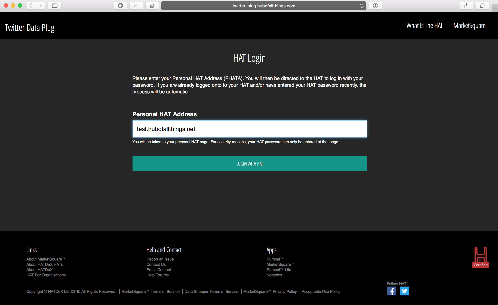

If you develop an application on the HAT, you will register your application with DEX, for it to provide [all the necessary details](01-application-information-format.html) to HATs.

Once registered, all HAT users will be able to discover your application and start using it. If the application setup is "Internal", the suer won't be redirected to your application from the Application setup flow, however for an app that is set to do an "External" status check, you will still receive a status check request with the HAT user's token. If, on the other hand, application setup is "External", HAT will redirect the user to your application, with associated token as a parameter.

Overall, you have three cases to handle:

1. User comes to you directly and you would like to log them in via their HAT
2. User comes to you from their HAT with an authentication token
3. Communication is handled in backend between the HAT and your backend

## User comes to you

To log the user in with their HAT, you need to ask for their HAT address. Depending on the status of your app within the HAT ecosystem you may have also have a specific `application name` and an allower `redirect url` for the user to be sent to to complete authentication. If you do not have these details, you can put any `application name` and `redirect url`. Authentication token you will receive from the HAT will reflect the settings in the Application manifest. Your own application is tasked with choosing the correct `redirect url` if the url varies across different platforms.



To log the user in, you therefore send them to `https://<<HAT_NAME>>/hatlogin?name=<<APPLICATION_NAME>>&redirect=<<REDIRECT_URL>>` endpoint of the HAT, where:

- `<<HAT_NAME>>` is the (fully qualified domain) name of the HAT of oyur user
- `<<APPLICATION_NAME>>` is the name of your application as explained above
- `<<REDIRECT_URL>>` is the URL where the usr should be sent for completing authentication

If you redirect the user to an existing HAT, they will be asked to login through an interface they are familiar with:


After logging in they will be asked to approve application permissions (if not yet active).

Note the login page is served via SSL and includes the complete address, name of the HAT as well as the application parameters - name and redirect url.

## User comes from the HAT

If the user approves application permissions, they get redirected to the URL provided, with `token` query parameter appended and containing a RS256-signed JWT token, e.g.:

```jsonnoselect
    https://twitter-plug.hubofallthings.com/authenticate/hat?token=eyJ0eXAiOiJKV1QiLCJhbGciOiJSUzI1NiJ9.eyJzdWIiOiJleUp3Y205MmFXUmxja2xFSWpvaVkzSmxaR1Z1ZEdsaGJITWlMQ0p3Y205MmFXUmxja3RsZVNJNkluUmxjM1FpZlE9PSIsInJlc291cmNlIjoiaHR0cHM6XC9cL3R3aXR0ZXItcGx1Zy5odWJvZmFsbHRoaW5ncy5jb21cL2F1dGhlbnRpY2F0ZVwvaGF0IiwiYWNjZXNzU2NvcGUiOiJ2YWxpZGF0ZSIsImlzcyI6InRlc3QuaHVib2ZhbGx0aGluZ3MubmV0IiwiZXhwIjoxNDk2OTIyNDIxLCJpYXQiOjE0OTY2NjMyMjEsImp0aSI6ImJlMGYyOTY3Nzk3MDc5MThkOWEzZDYxOGRkOTg5MGQ2MDRkMGRlMTg2MDEzYjE2MTYwNmU5ZmVmZDgxYmRjMmJjZTVjZDE2NWE2MTAxZWU0ZTU1NzJiYmVkMjIzYTRmOWRiNDcyNDc5YTBhMDY4ODkwNGZhN2QxZTUxNThjMzJlMzNhOTY5YWRmZTdkYzc4MmI4ODk1ZjJhY2E2MDMyOTM3NTRmZWJhNGUxNzNhMzE3ZmQ3ZDk1OTQyYzRmNTRkMWM3YWM5YzI3OThiYTZhODZhZWEzYTBmMzQ4OTI4MDJlZDQ4ZmU1NWEwMmUyYjgzNDJlODUxM2E2MTEzODBmYWIifQ.4thestm60WrueQmlBxDRp37uGKUtGpx6PeE4lB_xzlRmxrQ67vk1xFT1nyvFvZfGLnkq51GaB5UsA_zbMhhATC8dDWX1FjNiiRfjAj5r5LFTZW-hRnI0LodzyEJ8YMFbG_t-epSo_KsIig4Ardnzt5VioLwmdr37YJLHxmn1033ArBocVqsAg_pH8DghsaRbzdDWXHcwnCO5wtHJn0RVvAdXG5TKhegs3AuneYktTktvYjj__o66kn8DROKsqeICqCAJTxuJFQpBdoOlPXGgfUW4VQ1wcFC91MoPns1I04otuo6wglCXE576NnLHL3Q7ZKZ_CTVqmnlNg5txC_pnog
```

The token decodes to:

The Header:

```jsonnoselect
{
  "typ": "JWT",
  "alg": "RS256"
}
```

The Payload:

```jsonnoselect
{
  "sub": "eyJwcm92aWRlcklEIjoiY3JlZGVudGlhbHMiLCJwcm92aWRlcktleSI6InRlc3QifQ==",
  "resource": "https://twitter-plug.hubofallthings.com/authenticate/hat",
  "accessScope": "validate",
  "iss": "test.hubofallthings.net",
  "exp": 1496922421,
  "iat": 1496663221,
  "jti": "be0f296779707918d9a3d618dd9890d604d0de186013b161606e9fefd81bdc2bce5cd165a6101ee4e5572bbed223a4f9db472479a0a0688904fa7d1e5158c32e33a969adfe7dc782b8895f2aca603293754feba4e173a317fd7d95942c4f54d1c7ac9c2798ba6a86aea3a0f34892802ed48fe55a02e2b8342e8513a611380fab"
}
```

The key parts of the Payload are:

- The `resource`, which you must verify to check the token was intended for your service
- The `iss` (issuer), which is the address of the HAT that has creted the token and that you should be logging in
- The `exp` (expiry) time of the token as a Unix timestamp, defining whether or not the token is still valid
- The `application` which defines the rights of the token - application would not get permissions higher than pre-approved ones even though it (indirectly) uses HAT owner credentials.


And the Signature, which is generated from the token and the private key of the HAT. The signature must be validated to ensure that the token has not been tampered with. A HAT’s public key can be accessed at the `/publickey` endpoint of the HAT (e.g. `https://test.hubofallthings.net/publickey`). The precise handling of tokens with asymmetric keys will depend on your library, however you need to make sure that your library supports RS256 keys.

[jwt.io](https://jwt.io) contains a very useful tool for token debugging while in development as well as listing all the major JWT libraries.


JWT libraries [are available](https://jwt.io) in all major programming languages and most major frameworks implement wrappers for them. You should be careful in verifying the library of your choice is up to date and does not have reported security flaws in it.


## Backend communication

When communication happens between HAT and your backend, specifically when "External" status check gets executed. The check is equivalent to:

```shellnoselect
curl -X GET \
  <<STATUS_URL>> \
  -H 'x-auth-token: ACCESS_TOKEN'
```

In this case the token would be the same as explained above and your application is expected to store the token for future interaction with this specific user's HAT.


<nav class="pager-nav">
	<a href="01-application-information-format.html">Application information reference</a>
	<a href="03-application-management.html">Application management</a>
</nav>
