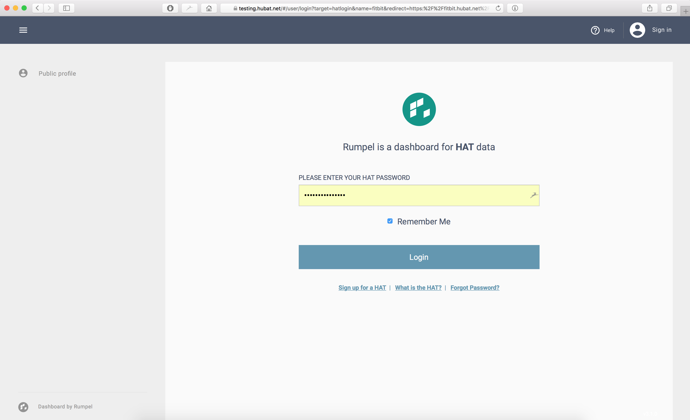

When logging in, the user sees a familiar and standard view, served by their own HAT:

Note the complete address is served via SSL, contains the name of the HAT as well as the application parameters - name and redirect url.

<nav class="pager-nav">
<a href="01-send-hat-login.html">Previous Step: Send user for HAT login</a>
<a href="03-verify-authenticate.html">Next step: Verify and authenticate user</a>
</nav>
