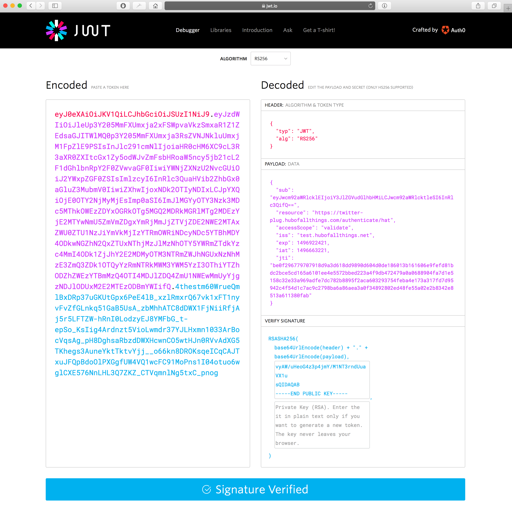

If the user logs in, they get redirected to the URL provided, with `token` query parameter appended and containing a RS256-signed JWT token, e.g.:

```jsonnoselect
	https://twitter-plug.hubofallthings.com/authenticate/hat?token=eyJ0eXAiOiJKV1QiLCJhbGciOiJSUzI1NiJ9.eyJzdWIiOiJleUp3Y205MmFXUmxja2xFSWpvaVkzSmxaR1Z1ZEdsaGJITWlMQ0p3Y205MmFXUmxja3RsZVNJNkluUmxjM1FpZlE9PSIsInJlc291cmNlIjoiaHR0cHM6XC9cL3R3aXR0ZXItcGx1Zy5odWJvZmFsbHRoaW5ncy5jb21cL2F1dGhlbnRpY2F0ZVwvaGF0IiwiYWNjZXNzU2NvcGUiOiJ2YWxpZGF0ZSIsImlzcyI6InRlc3QuaHVib2ZhbGx0aGluZ3MubmV0IiwiZXhwIjoxNDk2OTIyNDIxLCJpYXQiOjE0OTY2NjMyMjEsImp0aSI6ImJlMGYyOTY3Nzk3MDc5MThkOWEzZDYxOGRkOTg5MGQ2MDRkMGRlMTg2MDEzYjE2MTYwNmU5ZmVmZDgxYmRjMmJjZTVjZDE2NWE2MTAxZWU0ZTU1NzJiYmVkMjIzYTRmOWRiNDcyNDc5YTBhMDY4ODkwNGZhN2QxZTUxNThjMzJlMzNhOTY5YWRmZTdkYzc4MmI4ODk1ZjJhY2E2MDMyOTM3NTRmZWJhNGUxNzNhMzE3ZmQ3ZDk1OTQyYzRmNTRkMWM3YWM5YzI3OThiYTZhODZhZWEzYTBmMzQ4OTI4MDJlZDQ4ZmU1NWEwMmUyYjgzNDJlODUxM2E2MTEzODBmYWIifQ.4thestm60WrueQmlBxDRp37uGKUtGpx6PeE4lB_xzlRmxrQ67vk1xFT1nyvFvZfGLnkq51GaB5UsA_zbMhhATC8dDWX1FjNiiRfjAj5r5LFTZW-hRnI0LodzyEJ8YMFbG_t-epSo_KsIig4Ardnzt5VioLwmdr37YJLHxmn1033ArBocVqsAg_pH8DghsaRbzdDWXHcwnCO5wtHJn0RVvAdXG5TKhegs3AuneYktTktvYjj__o66kn8DROKsqeICqCAJTxuJFQpBdoOlPXGgfUW4VQ1wcFC91MoPns1I04otuo6wglCXE576NnLHL3Q7ZKZ_CTVqmnlNg5txC_pnog
```

The token decodes to:

The Header:

```jsonnoselect
{
  "typ": "JWT",
  "alg": "RS256"
}
```

The Payload:

```jsonnoselect
{
  "sub": "eyJwcm92aWRlcklEIjoiY3JlZGVudGlhbHMiLCJwcm92aWRlcktleSI6InRlc3QifQ==",
  "resource": "https://twitter-plug.hubofallthings.com/authenticate/hat",
  "accessScope": "validate",
  "iss": "test.hubofallthings.net",
  "exp": 1496922421,
  "iat": 1496663221,
  "jti": "be0f296779707918d9a3d618dd9890d604d0de186013b161606e9fefd81bdc2bce5cd165a6101ee4e5572bbed223a4f9db472479a0a0688904fa7d1e5158c32e33a969adfe7dc782b8895f2aca603293754feba4e173a317fd7d95942c4f54d1c7ac9c2798ba6a86aea3a0f34892802ed48fe55a02e2b8342e8513a611380fab"
}
```

The key parts of the Payload are:

- The `resource`, which you must verify to check the token was intended for your service
- The `iss` (issuer), which is the address of the HAT that has creted the token and that you should be logging in
- The `exp` (expiry) time of the token as a Unix timestamp, defining whether or not the token is still valid
- The `accessScope` which defines the rights of the token - websites without a prior registration within the ecosystem witll be issued with a `validate` scope token that only allows for validating authenticity of the token


And the Signature, which is generated from the token and the private key of the HAT. The signature must be verified to verify that the token has not been tampered with. A HAT’s public key can be accessed at the `/publickey` endpoint of the HAT (e.g. `https://test.hubofallthings.net/publickey`). The precise handling of tokens with asymmetric keys will depend on your library, however you need to make sure that your library supports RS256 keys.

[jwt.io](https://jwt.io) contains a very useful tool for token debugging while in development as well as listing all the major JWT libraries.



JWT libraries [are available](https://jwt.io) in all major programming languages and most major frameworks implement wrappers for them. You should be careful in verifying the library of your choice is up to date and does not have reported security flaws in it.

<nav class="pager-nav">
<a href="02-login-ui.html">Previous Step: User Logs in</a>
<a href="" style="display:none;"></a>
</nav>
